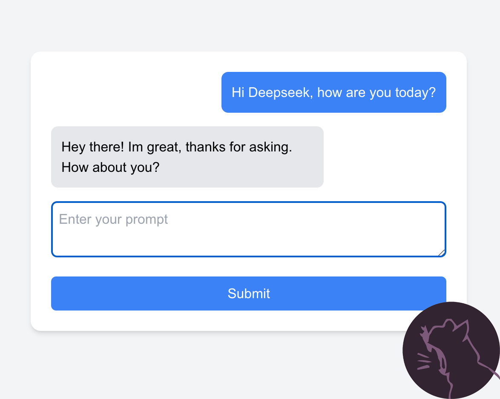

A Next.js application integrating DeepSeek AI capabilities.

> This project is based on the tutorial [How to Integrate DeepSeek with Next.js Using the OpenAI SDK, TypeScript, and Tailwind CSS](https://www.tinytiger.studio/blog/How-to-Integrate-DeepSeek-with-Next.js-Using-the-OpenAI-SDK%2C-TypeScript%2C-and-Tailwind-CSS%5B1e72958e-196a-4750-8ecc-8ff42f4bce73%5D) by [Tiny Tiger Studio](https://tinytiger.studio)

## Overview

This project combines the power of DeepSeek's AI models with Next.js framework to create a modern, responsive web application.

## Getting Started

1. Clone the repository:
```bash
git clone https://github.com/tiny-tiger-studio/deepseek-nextjs.git
```

2. Install dependencies:
```bash
npm install
```

3. Configure environment variables:
Create a `.env.local` file and add your DeepSeek API credentials.

4. Run the development server:
```bash
npm run dev
```

## Features

- Next.js app router
- DeepSeek AI capabilities
- Tailwind css

## Contributing

Pull requests are welcome. For major changes, please open an issue first.

## License

[MIT](https://choosealicense.com/licenses/mit/)